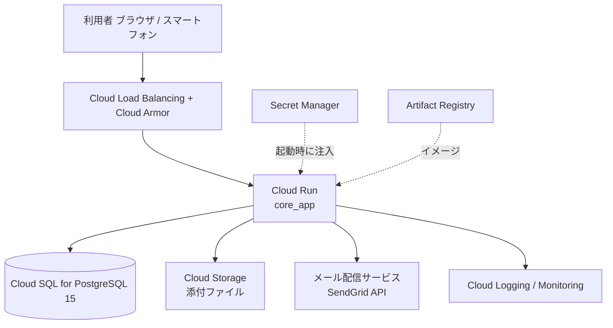

# 技術仕様書 (Architecture)

## 0. 本書の位置づけ

- **何を書くか**: [functional-design.md](functional-design.md) の機能を「どの技術で・どう動かすか」。技術選定、インフラ構成、アプリケーション層の構造、運用方針
- **何を書かないか**: 画面仕様・業務ルールは [functional-design.md](functional-design.md)、コードの書き方は [coding-rules.md](coding-rules.md)、UIの見た目の値は [DESIGN-notion.md](DESIGN-notion.md)
- **前提**: 自社向け単一テナント。車両300台・ユーザー300人・5〜10拠点規模（[product-requirements.md](product-requirements.md)）

---

## 1. 技術スタック

### 1.1 現在の構成（リポジトリ実測値）

| 分類 | 採用技術 | バージョン |
|------|---------|-----------|
| 言語 | Elixir | 1.20.4 (OTP 27) ※`Dockerfile.dev` |
| Webフレームワーク | Phoenix | 1.8.13 |
| UI | Phoenix LiveView | 1.2.0 |
| HTTPサーバー | Bandit | 1.5+ |
| ORM | Ecto SQL / Postgrex | 3.13+ |
| DB | PostgreSQL | 15.2（開発） |
| CSS | Tailwind CSS | 4.3.0 |
| JS bundler | esbuild | 0.25.4 |
| アイコン | Heroicons | v2.2.0 |
| メール | Swoosh | 1.16+ |
| HTTPクライアント | Req | 0.5+ |
| ID生成 | ecto_ulid_next | 1.0.2 |

> **要修正**: `CLAUDE.md` は「Elixir 1.18.2 / Phoenix 1.7.19」と記載しているが、実体は上表のとおり。本書の値に合わせて `CLAUDE.md` を更新する。

### 1.2 追加する依存

| ライブラリ | 用途 | 必須度 |
|-----------|------|-------|
| `oban` | 定時実行（期限アラート）、メール送信、CSV生成の非同期化 | P0 |
| `bcrypt_elixir` | パスワードハッシュ（`phx.gen.auth` の既定） | P0 |
| `goth` | GCP サービスアカウントのトークン取得 | P0 |
| `google_api_storage` | GCS へのファイル操作・署名URL発行 | P0 |
| `credo` | Lint（`make mix_credo` が参照するが**未導入**） | P0 |
| `nimble_csv` | CSV出力 | P1 |
| `excoveralls` | カバレッジ計測（`make mix_test_cover` の強化） | P2 |

`daisyui` は依存に含まれるが、`AGENTS.md` の方針に従い**コンポーネントとしては使用せず**、Tailwind で自前実装する。見た目の値は [DESIGN-notion.md](DESIGN-notion.md) のデザイントークンに従う（4.8）。

### 1.3 採用しない技術と理由

| 技術 | 不採用の理由 |
|------|------------|
| REST/GraphQL API 層 | 外部連携要件がなく、LiveView から Context を直接呼ぶ構成で足りる。API は Post-MVP のデジタコ連携（F-11）で検討 |
| Quantum / 外部 cron | Oban に cron・リトライ・実行履歴が揃っており、二重管理を避ける |
| Redis | セッションは Cookie、キャッシュ不要、PubSub は単一インスタンスで完結するため不要 |
| libcluster | Cloud Run ではインスタンス間の直接接続を前提にできない（3.4参照） |
| Dialyzer | [coding-rules.md](coding-rules.md) 3.3 に従い typespec を書かないため |

---

## 2. システム構成（GCP）

### 2.1 構成図



### 2.2 各コンポーネントの役割と設定

| コンポーネント | 設定 | 理由 |
|--------------|------|------|
| Cloud Run | **min-instances = 1**、CPU always allocated | Oban の cron ジョブと LiveView の常時接続を維持するため。スケールゼロさせない |
| Cloud Run | max-instances = 4、concurrency = 80 | 同時接続100セッションを2インスタンスで吸収できる |
| Cloud Run | リクエストタイムアウト 3600秒、セッションアフィニティ有効 | LiveView の WebSocket を維持するため |
| Cloud SQL | PostgreSQL 15、db-custom-2-7680 相当、自動バックアップ日次・7世代、PITR有効 | PRD の信頼性要件（7世代保持） |
| Cloud SQL 接続 | Cloud SQL Auth Proxy（Cloud Run の組み込み接続） | 接続元IP制限と暗号化 |
| Cloud Storage | 単一バケット `{project}-fleet-attachments`、非公開、均一アクセス制御、バージョニング有効 | 添付ファイルの誤削除対策 |
| Secret Manager | `SECRET_KEY_BASE` / `DATABASE_URL` / `SENDGRID_API_KEY` を保管 | リポジトリに秘密情報を置かない |
| Cloud Logging | Cloud Run 標準出力を収集。エラーログにアラートポリシーを設定 | 4.6参照 |

### 2.3 環境

| 環境 | 用途 | 構成 |
|------|------|------|
| development | ローカル開発 | Docker Compose（`web` + `db` + `pgadmin4`） |
| test | 自動テスト | CI（GitHub Actions）上の PostgreSQL サービスコンテナ |
| staging | 受入確認 | Cloud Run（min-instances = 0 で可）+ Cloud SQL（小サイズ） |
| production | 本番 | 2.2 の構成 |

---

## 3. アプリケーション構成

### 3.1 ディレクトリ構造

[coding-rules.md](coding-rules.md) 2.1 に従い、**ドメイン層は Context + スキーマの2層**とする。

```
lib/
├── core_app/
│   ├── application.ex
│   ├── repo.ex
│   ├── mailer.ex
│   ├── accounts.ex                    # ユーザー・認証
│   ├── accounts/
│   │   ├── user.ex
│   │   ├── user_token.ex
│   │   ├── user_notifier.ex
│   │   └── scope.ex                   # Phoenix 1.8 の current_scope
│   ├── offices.ex                     # 拠点
│   ├── offices/office.ex
│   ├── vehicles.ex                    # 車両台帳
│   ├── vehicles/vehicle.ex
│   ├── drivers.ex                     # 運転者台帳
│   ├── drivers/driver.ex
│   ├── operation_reports.ex           # 運行日報（集約ルート）
│   ├── operation_reports/
│   │   ├── operation_report.ex
│   │   └── refueling.ex               # 子エンティティ（専用 Context は作らない）
│   ├── maintenances.ex                # 点検整備
│   ├── maintenances/maintenance.ex
│   ├── incidents.ex                   # 事故・ヒヤリ
│   ├── incidents/incident.ex
│   ├── attachments.ex                 # 添付ファイル
│   ├── attachments/attachment.ex
│   ├── alerts.ex                      # 期限判定・通知ログ
│   ├── alerts/alert_notification.ex
│   ├── audit_logs.ex                  # 監査ログ
│   ├── audit_logs/audit_log.ex
│   ├── reports.ex                     # 集計クエリ（読み取り専用 Context）
│   ├── workers/                       # Oban ワーカー
│   │   ├── deadline_alert_worker.ex
│   │   ├── alert_mail_worker.ex
│   │   └── csv_export_worker.ex
│   └── utils/
│       ├── gcs.ex                     # Cloud Storage 操作
│       ├── convert_datetime.ex        # UTC ⇔ JST 変換
│       ├── format.ex                  # 距離・金額・日時の表示整形
│       └── logger.ex                  # 構造化ログのラッパー
└── core_app_web/
    ├── router.ex
    ├── endpoint.ex
    ├── user_auth.ex                   # plug と on_mount
    ├── components/
    │   ├── core_components.ex
    │   ├── layouts.ex
    │   ├── table_components.ex        # 一覧テーブル（モバイルでカード化）
    │   ├── search_components.ex       # 絞り込みフォーム
    │   ├── pagination_components.ex
    │   └── status_components.ex       # ステータスバッジ
    └── live/
        ├── dashboard_live/
        ├── operation_report_live/
        │   ├── driver/                # 一般利用者向け /operation_reports
        │   └── manager/               # 管理者向け /management/operation_reports
        ├── incident_live/
        │   ├── driver/
        │   └── manager/
        ├── vehicle_live/
        ├── driver_live/
        ├── maintenance_live/
        ├── alert_live/
        ├── report_live/
        ├── office_live/
        ├── user_live/
        └── audit_log_live/
```

### 3.2 レイヤ間の約束

| ルール | 内容 |
|-------|------|
| Web 層から `Repo` を呼ばない | 取得条件は Context 関数として追加する |
| Context 関数は必ず `scope` を受け取る | `Accounts.Scope` を第1引数に取り、拠点・ロールによる絞り込みをクエリ層で強制する |
| 子エンティティ専用 Context を作らない | `refueling` の CRUD は `OperationReports` に置く |
| Context が 800行 or 集約3つを超えたら分割する | [coding-rules.md](coding-rules.md) 2.1 |

### 3.3 スコープ（`Accounts.Scope`）

Phoenix 1.8 の `current_scope` を採用し、認可の判断材料を1つの構造体に集約する。

```elixir
%CoreApp.Accounts.Scope{
  user: %User{},        # ログインユーザー
  office_id: "01J...",  # 所属拠点ID
  role: :manager,       # :admin | :manager | :member
  driver_id: "01J..."   # 紐付く運転者ID（未紐付け・未preload は nil）
}
```

Context のクエリは `scope` に応じて条件を付与する。

`driver_id` はセッション経由で取得した利用者（`:driver` を preload 済み）にのみ入る。
preload していない `User` から `Scope.for_user/1` を呼んだ場合は `nil` になるため、
運転者の特定が必須の処理ではセッション由来のスコープを使う。

| role | 付与される条件 |
|------|--------------|
| `:admin` | なし（全拠点） |
| `:manager` | `where: [office_id: ^scope.office_id]` |
| `:member` | `where: [office_id: ^scope.office_id]` かつ自分に紐づく条件（`driver_id` / `created_by_user_id`） |

**この絞り込みを LiveView 側で行わない**。Context の関数シグネチャで `scope` を必須にすることで、付け忘れをコンパイル時に検出できるようにする。

### 3.4 PubSub とクラスタリング

Cloud Run はインスタンス間の相互接続を前提にできないため、`DNSCluster` は無効（`DNS_CLUSTER_QUERY` を未設定）とする。

MVP の機能にインスタンス横断のリアルタイム同期要件はない（日報の承認は同一ユーザーの操作で完結する）ため、`Phoenix.PubSub.PG2` の単一ノード動作で足りる。将来、他ユーザーの操作を即時反映する要件が出た場合は Postgres 通知ベースのアダプタ導入を検討する。

---

## 4. 主要機能の実装方針

### 4.1 認証・認可

| 項目 | 方針 |
|------|------|
| 生成 | `mix phx.gen.auth Accounts User users --live --hashing-lib bcrypt` |
| パスワードハッシュ | bcrypt（`bcrypt_elixir`）。コスト12 |
| パスワードポリシー | 12文字以上。`changeset` でバリデーション |
| アカウントロック | ログイン失敗10回で15分ロック。`users.failed_attempts` / `locked_until` を追加 |
| セッション | Cookie ベース、最終操作から8時間で失効（`max_age`） |
| サインアップ | **公開しない**（生成された `/users/register` は削除済み）。管理者が `Accounts.create_user/1` でアカウントを発行する |
| 初回パスワード設定・パスワード忘れ | Phoenix 1.8 が生成する**ログインリンク（マジックリンク）**を転用する。リンクでログイン後、設定画面でパスワードを設定する |
| 管理者が初期パスワードを設定した場合 | 自己登録の経路が無く、メールアドレスは管理者が保証するため、作成時点で確認済み（`confirmed_at`）として扱う |
| ルーター | `live_session` を3種（`:require_authenticated_user` / `:require_manager` / `:require_admin`）に分け、`on_mount` は `:require_authenticated` / `:require_manager` / `:require_admin`、plug は `require_authenticated_user` / `require_manager_user` / `require_admin_user` を対で指定する |
| plug と on_mount の一致 | [coding-rules.md](coding-rules.md) 8.3 に従い、pipeline の認可 plug と `on_mount` の強さを必ず揃える |
| レコード単位の認可 | Context 関数が `scope` で絞り込むため、`get_vehicle!(scope, id)` が他拠点のIDで `Ecto.NoResultsError` を返す。LiveView はこれを 404 として扱う |

### 4.2 データベース

| 項目 | 方針 |
|------|------|
| 主キー | ULID（`Ecto.ULID`、26文字）。`config.exs` の `binary_id: true` と合わせ、スキーマで `@primary_key {:id, Ecto.ULID, autogenerate: true}` を指定 |
| 外部キー | すべて `references` で制約を張り、`on_delete: :restrict` を既定とする |
| 日時 | `:utc_datetime` で保存。表示時のみ `Utils.ConvertDatetime` で JST 変換 |
| 論理削除 | `status` / `employment_type` / `active` で表現し、`deleted_at` 方式は使わない |
| マイグレーション命名 | `{timestamp}_{動詞_対象}.exs`（例: `20260401093000_create_vehicles.exs`） |
| インデックス | [functional-design.md](functional-design.md) 4.3 の `IDX` / 複合インデックスを作成時に張る |
| N+1 対策 | 一覧クエリは `preload` を明示。LiveView 側で遅延ロードしない |
| ページネーション | `limit` / `offset` 方式（1ページ50件）。50万件規模でも `(office_id, operation_date)` インデックスで要件を満たす |
| 接続プール | `POOL_SIZE = 10`（インスタンスあたり）。max-instances 4 で最大40接続、Cloud SQL の上限内に収める |

### 4.3 非同期処理（Oban）

| キュー | 並列度 | 用途 |
|-------|-------|------|
| `default` | 5 | 汎用 |
| `mailers` | 3 | メール送信 |
| `alerts` | 2 | 期限判定 |
| `exports` | 2 | CSV生成 |

**cron 設定**

| スケジュール | ワーカー | 処理 |
|-------------|---------|------|
| `0 22 * * *`（UTC / JST 07:00） | `DeadlineAlertWorker` | 期限対象を走査し、通知対象ごとに `AlertMailWorker` をエンキュー |

`AlertMailWorker` は `mailers` キューで動き、1アラートにつき1通を対象拠点の運行管理者全員と全管理者へ送る。

**ジョブ設計の約束**

- `DeadlineAlertWorker` は判定のみを行い、**メール送信は1通=1ジョブ**に分割する（1通の失敗が全体を止めない）
- 冪等性は `alert_notifications` のユニーク制約 `(target_type, target_id, alert_type, deadline_on, notify_stage, notified_on)` で担保する。Oban のリトライで二重送信しない。`notified_on`（通知日）を含めるのは、超過の再通知を7日ごとに行うため（[functional-design.md](functional-design.md) 4.3）
- エンキュー自体の重複は `AlertMailWorker` の `unique`（20時間）でも防ぐ
- `max_attempts: 5`、指数バックオフ。最終失敗時は `status = failed` を記録し、翌日の実行で再送対象に含める
- ジョブ内で `Scope` を用いず、システム権限で全拠点を走査する（通知は横断処理のため）
- Oban の実行履歴（`oban_jobs`）は7日で剪定する（`Oban.Plugins.Pruner`）

### 4.4 ファイルストレージ（GCS）

| 項目 | 方針 |
|------|------|
| バケット構成 | `attachments/{attachable_type}/{attachable_id}/{ULID}_{元ファイル名}` |
| アップロード | LiveView の `allow_upload`（`max_file_size: 10MB`, `accept: ~w(.pdf .jpg .jpeg .png)`）で受け、`consume_uploaded_entries` 内で GCS へ転送する |
| 検証 | 拡張子に加え、先頭バイト（マジックナンバー）で MIMEタイプを検証する。不一致は拒否 |
| ダウンロード | 有効期限15分の**署名付きURL**を都度発行する。公開URLは持たせない |
| 認証 | Cloud Run のサービスアカウント + `goth`。開発環境はサービスアカウントキーを `.env` から読む（リポジトリにコミットしない） |
| 削除 | レコード削除時も GCS のオブジェクトは即時削除せず、バケットのライフサイクル（削除マーカー後30日）で消す |
| 抽象化 | `Utils.Gcs` にインターフェースを閉じ込め、保存先の差し替えを1モジュールの変更で済ませる |

### 4.5 メール送信

| 項目 | 方針 |
|------|------|
| ライブラリ | Swoosh |
| 本番アダプタ | `Swoosh.Adapters.Sendgrid`（HTTP API） |
| 理由 | **Cloud Run は 25/465/587 番ポートの外向き SMTP がブロックされる**ため、SMTP 直送は使えない。HTTP API 経由のサービスを使う |
| 開発 | `Swoosh.Adapters.Local`（`/dev/mailbox` でプレビュー） |
| テスト | `Swoosh.Adapters.Test` |
| 送信種別 | 初回パスワード設定、パスワードリセット、期限アラート、日報差戻し通知（P1） |
| 送信元 | `no-reply@{ドメイン}`。SPF / DKIM を設定する |
| 失敗時 | Oban のリトライに任せ、最終失敗は `alert_notifications.status = failed` とエラーログに記録 |

### 4.6 ロギング・監視

| 項目 | 方針 |
|------|------|
| ログ出力 | 標準出力へ JSON 形式で出力し、Cloud Logging が収集する |
| ログラッパー | `Utils.Logger` に集約し、`user_id` / `office_id` / `request_id` をメタデータに付与する |
| 個人情報 | ログにパスワード・トークン・免許証番号を出力しない |
| 監査ログ | アプリケーションの DB テーブル（`audit_logs`）に記録。Cloud Logging とは別管理（保持3年・検索性のため） |
| メトリクス | `CoreAppWeb.Telemetry` の既定に加え、Oban ジョブの成否、期限アラート送信数を計測 |
| LiveDashboard | 本番でも `/management/live_dashboard` に**管理者のみ**アクセス可として公開（`:require_admin` の live_session 配下） |
| アラート | Cloud Monitoring で「エラーログ5分間に10件以上」「Cloud Run の 5xx 率1%超」「Oban ジョブ失敗」を通知 |

### 4.7 CSV出力

- 10,000件までは同期生成し、その場でダウンロードさせる
- 10,000件超は `CsvExportWorker` で非同期生成 → GCS に配置 → 完了メールに署名URLを載せる（上限50,000件）
- `NimbleCSV` を使用し、UTF-8 BOM 付き・CRLF で出力する

### 4.8 UI とデザイントークン

UI の配色・タイポグラフィ・角丸・余白・コンポーネント仕様は [DESIGN-notion.md](DESIGN-notion.md) を唯一の情報源とする。

| 項目 | 方針 |
|------|------|
| トークンの定義場所 | `assets/css/app.css` の `@theme` に CSS変数として定義する（Tailwind v4 の方式） |
| 余白（spacing） | **名前付きトークンを定義しない**。`--spacing-sm` などは Tailwind 組み込みのサイズ名と衝突し、`max-w-sm` が 24rem ではなく 12px に解決されるなどの破損を招く。`DESIGN-notion.md` の余白は 4px グリッド上にあるため、Tailwind の numeric スケール（`1` = 4px）で表現する<br>`xxs`→`1` / `xs`→`2` / `sm`→`3` / `md`→`4` / `lg`→`6` / `xl`→`7` / `xxl`→`8` |
| HEEx での使用 | 定義したトークン名のユーティリティクラスを使う。**生の16進数カラーコードを HEEx に書かない** |
| フォント | `NotionInter` は使用できないため **Inter** を採用し、日本語は `Noto Sans JP` にフォールバックする。フォントは self-host し、外部CDNを参照しない（`AGENTS.md`） |
| ダークモード | MVP ではライトのみ（`DESIGN-notion.md` の配色がライト前提のため） |
| コンポーネント | `DESIGN-notion.md` の `components` に対応する名前で `core_components.ex` / `*_components.ex` に実装する |
| daisyUI | 自前のコンポーネントでは使わない。ただし `phx.gen.auth` が生成した画面（ログイン・設定）が依存しているため読み込みは残し、**テーマの値を `DESIGN-notion.md` のトークンに揃える**ことで見た目を統一する。生成画面を作り直す際に依存を外す |

**主要トークンの用途対応**

| 用途 | トークン |
|------|---------|
| ページ背景 | `canvas-soft` (#f6f5f4) |
| カード・テーブル面 | `surface` (#ffffff) |
| 主要アクション（保存・提出・承認） | `primary` (#0075de) / 押下時 `primary-active` |
| 本文 / 補助テキスト | `ink` / `ink-muted` |
| 罫線・区切り | `hairline` (#e6e6e6) |
| 一覧テーブル | `ex-data-table-cell`（ヘッダー背景 `canvas-soft` + `eyebrow`） |
| 入力欄 | `text-input`（`rounded.xs` / `body-sm`） |
| ダイアログ | `ex-modal-card` |
| 空状態 | `ex-empty-state-card` |

**本システム固有の状態色**（`accent-*` から割り当て、新たな色を持ち込まない）

| 状態 | トークン |
|------|---------|
| 期限超過 / 差戻し / 人身事故 | `accent-orange-deep` (#793400) |
| 期限7日以内 / 未承認 | `accent-orange` (#dd5b00) |
| 期限30日以内 / 原因分析中 | `accent-purple-deep` (#391c57) |
| 承認済み / 完了 / 稼働中 | `accent-green` (#1aae39) |
| ヒヤリハット / 全社共有 | `accent-teal` (#2a9d99) |
| 休車 / 下書き | `ink-faint` (#a39e98) |

`DESIGN-notion.md` に定義のない部品が必要になった場合は、**先に `DESIGN-notion.md` へ追加してから実装する**（実装側で独自の値を決めない）。

---

## 5. 設定と秘密情報

すべての環境依存値は `config/runtime.exs` に集約する（[coding-rules.md](coding-rules.md) 13章）。

| 環境変数 | 用途 | 供給元（本番） |
|---------|------|--------------|
| `SECRET_KEY_BASE` | Cookie 署名 | Secret Manager |
| `DATABASE_URL` | Cloud SQL 接続 | Secret Manager |
| `POOL_SIZE` | DB接続プール | Cloud Run 環境変数 |
| `PHX_HOST` | 公開ホスト名 | Cloud Run 環境変数 |
| `PHX_SERVER` | サーバー起動フラグ（`true`） | Cloud Run 環境変数 |
| `PORT` | 待ち受けポート | Cloud Run が自動設定 |
| `GCS_BUCKET` | 添付ファイルのバケット名 | Cloud Run 環境変数 |
| `SENDGRID_API_KEY` | メール送信 | Secret Manager |
| `MAIL_FROM` | 送信元アドレス | Cloud Run 環境変数 |
| `TZ_DISPLAY` | 表示タイムゾーン（既定 `Asia/Tokyo`） | Cloud Run 環境変数 |
| `ALERT_CRON_ENABLED` | 期限アラート cron の有効/無効（staging で無効化） | Cloud Run 環境変数 |

`DNS_CLUSTER_QUERY` は設定しない（3.4）。

---

## 6. ビルドとデプロイ

### 6.1 本番イメージ

- `mix phx.gen.release --docker` で生成する `Dockerfile` をベースに、マルチステージビルドで `mix release` を作成する
- ランナーイメージは `debian:bookworm-slim`。開発用の `Dockerfile.dev` とは別ファイルとする
- アセットは `mix assets.deploy`（Tailwind / esbuild の minify + `phx.digest`）をビルド段階で実行する

### 6.2 パイプライン

```
GitHub push (main)
  └─ GitHub Actions
       ├─ mix compile --warnings-as-errors
       ├─ mix format --check-formatted
       ├─ mix credo --all
       ├─ mix test
       └─ Cloud Build → Artifact Registry → Cloud Run デプロイ
```

`make check` はローカルの同等チェック。**CI のチェック項目と `make check` の内容は常に一致させる**。

### 6.3 マイグレーション

- リリースに `CoreApp.Release.migrate/0` を用意し、デプロイ前に Cloud Run ジョブとして実行する
- アプリ起動時の自動マイグレーションは行わない（複数インスタンス同時起動での競合を避けるため）
- 後方互換性を守る（列の削除・リネームは「追加 → 両対応 → 削除」の3段階でデプロイする）

### 6.4 ロールバック

- Cloud Run のリビジョン切り戻しで対応する
- **DB マイグレーションを伴う変更は切り戻せない前提**で設計する（6.3 の3段階デプロイを守る）

---

## 7. 非機能要件への対応

[product-requirements.md](product-requirements.md) の非機能要件に対する実装上の担保。

| 要件 | 対応 |
|------|------|
| 一覧表示 1.0秒以内（P95） | 複合インデックス + 50件ページネーション + `preload` の明示 |
| 日報保存 500ms以内 | 単一トランザクション、メール送信は Oban に逃がす |
| 同時接続100セッション | Cloud Run concurrency 80 × min 1 / max 4 インスタンス |
| 稼働率 99.5% | Cloud Run のマネージド冗長 + Cloud SQL の自動フェイルオーバー（HA構成は費用と要相談） |
| バックアップ7世代 | Cloud SQL 自動バックアップ + PITR |
| データ保持（日報5年・事故10年・監査3年） | 物理削除しない。保持期間超過分の削除バッチは Post-MVP |
| パスワード保護 | bcrypt コスト12、平文保存なし |
| 3層認可 | 4.1 のとおり router / LiveView / クエリで実施 |
| 監査ログの改変不可 | アプリから UPDATE / DELETE 関数を提供しない。DB ロールでも当該テーブルの更新権限を与えない |
| 通信のHTTPS化 | Cloud Load Balancing で TLS 終端、`force_ssl` + HSTS を Endpoint に設定 |
| 個人情報のキャッシュ抑止 | 該当画面のレスポンスに `Cache-Control: no-store` を付与する plug を追加 |
| 添付の形式検証 | 4.4 のとおり拡張子 + マジックナンバー |
| 車両1,000台・日報200万件までの拡張 | インデックス追加のみで対応できるスキーマ設計。集計は事前集計テーブルを使わず、必要になった時点で導入 |

---

## 8. 開発環境

### 8.1 現状

Docker Compose（`web` / `db` / `pgadmin4`）。操作は `Makefile` 経由（`make setup` / `make up` / `make check` など、コマンド一覧は `CLAUDE.md`）。

### 8.2 テンプレート由来の不整合（2026-09-13 解消済み）

`.steering/20260913-project-setup` で以下を解消した。

| # | 箇所 | 対応 |
|---|------|------|
| 1 | `mix.exs` | `credo` を追加。`make check` が通る状態になった |
| 2 | `docker-compose.yml` | ノード名・Cookie を `core_app` に変更 |
| 3 | `docker-compose.yml` | 非推奨の `version: '3'` を削除 |
| 4 | `CLAUDE.md` | 技術スタックの記載を実体に修正 |
| 5 | `test/` | `fleet_managment_system_web/` → `core_app_web/` にリネーム |
| 6 | `lib/core_app_web/components/layouts/` | `Layouts.app`（サイドバー・ヘッダー・フラッシュ）を実装 |
| 7 | `config/test.exs` | DB接続先が `localhost` のままでテストが実行できなかったため `PGHOST` を参照するよう修正 |
| 8 | `assets/css/app.css` | `@source` と colocated CSS の参照先が `fleet_managment_system`（存在しないアプリ名）だったため `core_app` に修正 |
| 9 | `.gitignore` | パッケージ名の誤りを修正し、`.env` とサービスアカウントキーの除外を追加 |

### 8.3 モジュール名の方針

OTP アプリ名は **`core_app` / `CoreApp` のまま**とする（リネームによる差分の発生を避けるため）。リポジトリ名（`fleet_management_system`）との不一致は本書に明記することで許容する。

---

## 9. テスト方針

| 層 | 対象 | 方針 |
|----|------|------|
| Context | すべての公開関数 | 正常系・異常系・**スコープ境界**（他拠点のデータが取得できないこと）を必ず含める |
| スキーマ | changeset | [functional-design.md](functional-design.md) 6章の V-1〜V-28 に1対1でテストを対応させる |
| LiveView | 主要フロー | 日報の作成→提出→承認、事故報告→改善報告→承認、期限アラート一覧の表示 |
| 認可 | 全 `/management` 配下 | 各ロールでアクセスし、403 / 404 が返ることを検証する |
| Oban | ワーカー | `Oban.Testing` で手動実行し、重複送信が起きないことを検証する |
| メール | 送信内容 | `Swoosh.TestAssertions` で宛先・件名を検証する |

フィクスチャは `test/support/fixtures/{context}_fixtures.ex` に置く（[coding-rules.md](coding-rules.md) 15章）。

---

## 10. 未確定事項

| # | 項目 | 判断時期 |
|---|------|---------|
| 1 | メール配信サービスの契約（SendGrid / Mailgun / Resend） | 実装着手前 |
| 2 | Cloud SQL を HA 構成にするか（費用と稼働率要件のトレードオフ） | インフラ構築時 |
| 3 | 独自ドメインと SPF / DKIM の設定主体 | 実装着手前 |
| 4 | staging 環境を用意するか | 開発計画確定時 |
| 5 | 保持期間超過データの削除バッチ（PRD のデータ保持要件） | Post-MVP |
| 6 | Cloud Armor による IP 制限の要否（社内からのみ許可するか） | インフラ構築時 |
