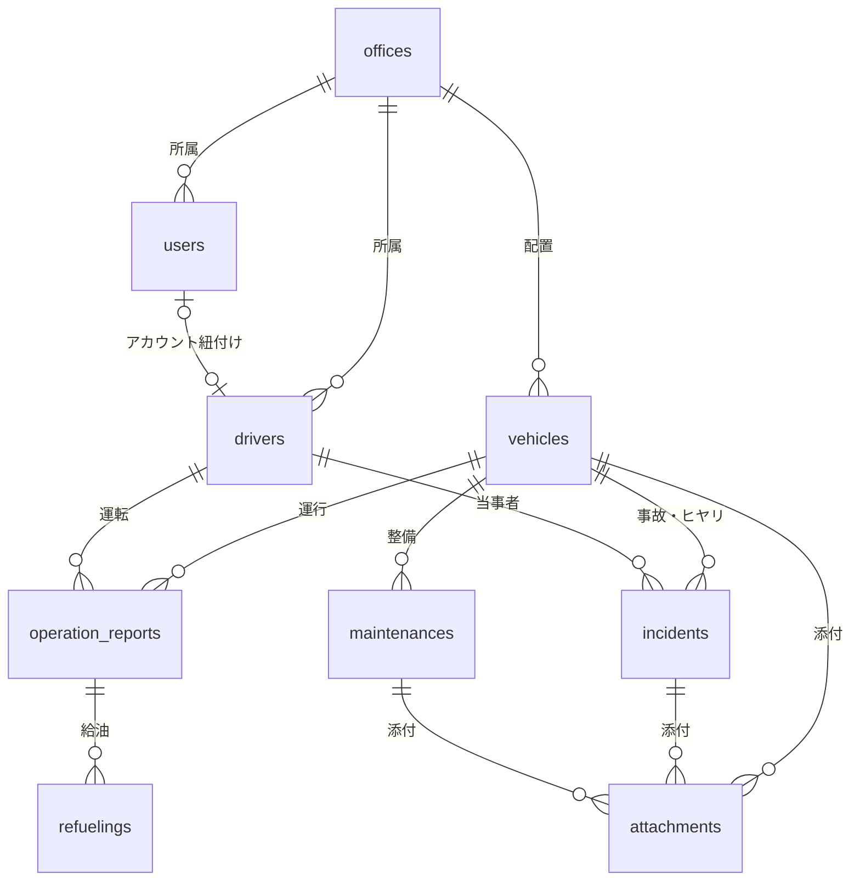
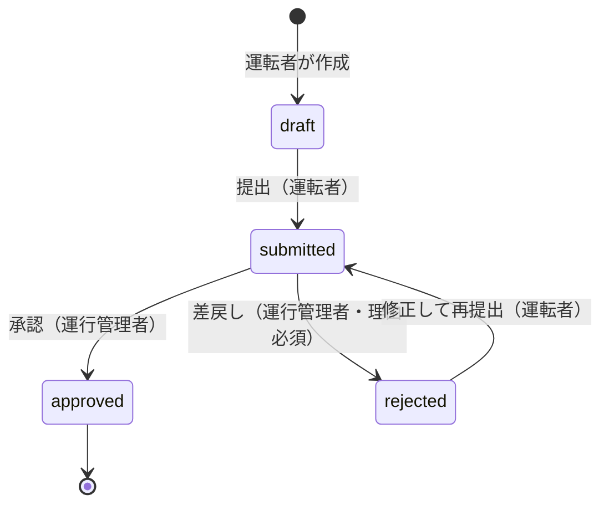
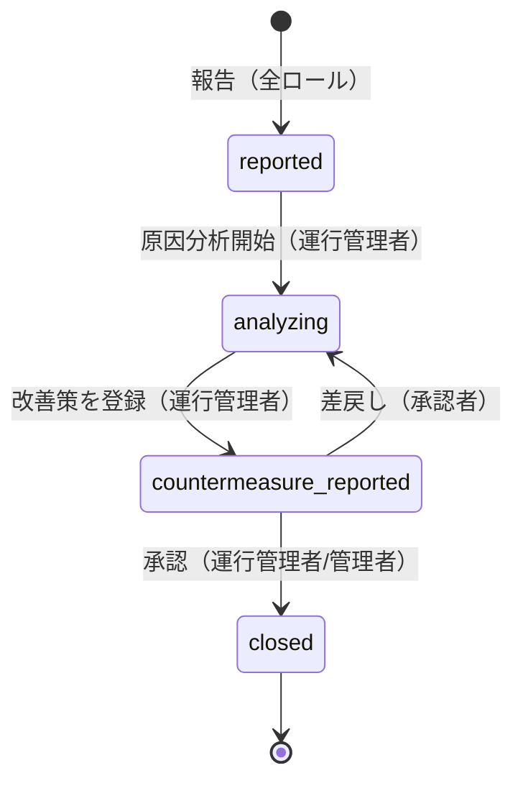

# 機能設計書 (Functional Design)

## 0. 本書の位置づけ

- **何を書くか**: [product-requirements.md](product-requirements.md) で定義した要求を、画面・データ・業務ルールのレベルまで具体化する
- **何を書かないか**: 技術スタックの選定理由、デプロイ構成、モジュール名などの実装詳細は [architecture.md](architecture.md)、コードの書き方は [coding-rules.md](coding-rules.md)、UIの配色・タイポグラフィなどの見た目は [DESIGN-notion.md](DESIGN-notion.md) を参照
- **対象範囲**: PRD の MVP機能 F-1〜F-7

命名・ID・URL の規約は [coding-rules.md](coding-rules.md) に従う。主キーは ULID（26文字）、日時は UTC 保存・JST 表示とする。

---

## 1. 機能一覧

| ID | 機能 | 主な利用ロール | 優先度 |
|----|------|--------------|--------|
| F-1 | 組織・拠点・ユーザー管理 | 管理者 | P0 |
| F-2 | 車両台帳管理 | 運行管理者 / 管理者 | P0 |
| F-3 | 運転者台帳管理 | 運行管理者 / 管理者 | P0 |
| F-4 | 運行日報・走行記録 | 運転者 / 運行管理者 | P0 |
| F-5 | 点検・整備記録と期限アラート | 運行管理者 / 管理者 | P0 |
| F-6 | 事故・ヒヤリ記録と改善報告 | 全ロール | P0 |
| F-7 | ダッシュボードとデータ出力 | 全ロール | P1 |

---

## 2. ロールと権限

### 2.1 ロール定義

| ロール | 値 | データスコープ |
|--------|-----|--------------|
| 管理者 | `admin` | 全拠点 |
| 運行管理者 | `manager` | 所属拠点のみ |
| 一般利用者（運転者） | `member` | 自分が作成した記録・自分が運転者の記録のみ |

### 2.2 権限マトリクス

`○`=可 / `△`=条件付き / `×`=不可

| 操作 | admin | manager | member |
|------|:-----:|:-------:|:------:|
| 拠点マスタの管理 | ○ | × | × |
| ユーザーの登録・ロール変更・無効化 | ○ | × | × |
| 監査ログの参照 | ○ | × | × |
| 車両の登録・編集 | ○ | △ 自拠点 | × |
| 車両の参照 | ○ | △ 自拠点 | △ 自拠点（読み取りのみ） |
| 運転者の登録・編集 | ○ | △ 自拠点 | × |
| 運転者の参照 | ○ | △ 自拠点 | × |
| 日報の作成・下書き編集 | ○ | △ 自拠点 | △ 自分が運転者の日報 |
| 日報の提出 | ○ | △ 自拠点 | △ 自分の日報 |
| 日報の承認・差戻し | ○ | △ 自拠点 | × |
| 日報の参照 | ○ | △ 自拠点 | △ 自分の日報 |
| 点検整備記録の登録・編集 | ○ | △ 自拠点 | × |
| 事故・ヒヤリの報告 | ○ | ○ | ○ |
| 事故・ヒヤリの原因分析・改善策の登録 | ○ | △ 自拠点 | × |
| 改善報告の承認 | ○ | △ 自拠点 | × |
| 事故・ヒヤリの全社共有設定 | ○ | × | × |
| 全社共有されたヒヤリの参照 | ○ | ○ | ○ |
| CSV出力 | ○ | △ 自拠点 | × |

### 2.3 認可の実装方針

[coding-rules.md](coding-rules.md) の方針に従い、**3層で認可する**。1層の漏れが他拠点データの露出につながらないようにする。

| 層 | 内容 |
|----|------|
| ルーター | `live_session` の `on_mount` でロールを検証（`ensure_authenticated` / `ensure_manager` / `ensure_admin`） |
| LiveView / Controller | 対象レコードの所属拠点と `current_user.office_id` を突合し、不一致なら 403 画面へ |
| クエリ | 一覧・検索クエリに拠点条件を必ず付与する（Context 関数の引数に `scope` を必須で受け取る） |

`member` は自分に紐づくレコードのみを対象とするため、クエリ層で `driver_id` または `created_by_user_id` の条件を追加する。

---

## 3. 画面一覧と URL 設計

URL は [coding-rules.md](coding-rules.md) 8.4 に従い、一般利用者向けを `/{resources}`、管理者・運行管理者向けを `/management/{resources}` とする。

### 3.1 認証系

| 画面 | URL | アクセス可能ロール |
|------|-----|------------------|
| ログイン（パスワード / ログインリンク） | `/users/log-in` | 未認証 |
| ログインリンクからのログイン | `/users/log-in/:token` | 未認証 |
| ログアウト | `/users/log-out`（DELETE） | 全ロール |
| メールアドレス・パスワード変更 | `/users/settings` | 全ロール |
| メールアドレス変更の確認 | `/users/settings/confirm-email/:token` | 全ロール |

**サインアップ画面は提供しない**。アカウントは管理者が発行する（F-1）。

パスワードを忘れた場合は、ログイン画面でメールアドレスを入力して**ログインリンク**を受け取り、ログイン後に設定画面でパスワードを変更する。初回パスワードの設定も同じ経路を使う。

### 3.2 一般利用者向け（運転者）

| 画面 | URL | live_action |
|------|-----|-------------|
| ダッシュボード | `/` | `:index` |
| 自分の日報一覧 | `/operation_reports` | `:index` |
| 日報 新規作成 | `/operation_reports/new` | `:new` |
| 日報 編集 | `/operation_reports/:id/edit` | `:edit` |
| 日報 詳細 | `/operation_reports/:id` | `:show` |
| 事故・ヒヤリ 一覧（自分の報告＋全社共有） | `/incidents` | `:index` |
| 事故・ヒヤリ 報告 | `/incidents/new` | `:new` |
| 事故・ヒヤリ 詳細 | `/incidents/:id` | `:show` |
| 車両 参照一覧（自拠点） | `/vehicles` | `:index` |
| 車両 参照詳細 | `/vehicles/:id` | `:show` |

### 3.3 運行管理者・管理者向け

| 画面 | URL | 可能ロール |
|------|-----|-----------|
| 車両一覧 | `/management/vehicles` | admin / manager |
| 車両 登録・編集 | `/management/vehicles/new`, `/management/vehicles/:id/edit` | admin / manager |
| 車両 詳細（履歴タブ付き） | `/management/vehicles/:id` | admin / manager |
| 運転者一覧 | `/management/drivers` | admin / manager |
| 運転者 登録・編集 | `/management/drivers/new`, `/management/drivers/:id/edit` | admin / manager |
| 運転者 詳細 | `/management/drivers/:id` | admin / manager |
| 日報一覧（承認待ち含む） | `/management/operation_reports` | admin / manager |
| 日報 詳細・承認 | `/management/operation_reports/:id` | admin / manager |
| 点検整備記録 一覧 | `/management/maintenances` | admin / manager |
| 点検整備記録 登録・編集 | `/management/maintenances/new`, `/management/maintenances/:id/edit` | admin / manager |
| 点検整備記録 詳細 | `/management/maintenances/:id` | admin / manager |
| 期限アラート一覧 | `/management/alerts` | admin / manager |
| 事故・ヒヤリ 一覧 | `/management/incidents` | admin / manager |
| 事故・ヒヤリ 詳細・分析・承認 | `/management/incidents/:id` | admin / manager |
| 集計レポート | `/management/reports` | admin / manager |
| 拠点一覧 | `/management/offices` | admin |
| 拠点 登録・編集 | `/management/offices/new`, `/management/offices/:id/edit` | admin |
| ユーザー一覧 | `/management/users` | admin |
| ユーザー 登録・編集 | `/management/users/new`, `/management/users/:id/edit` | admin |
| 監査ログ一覧 | `/management/audit_logs` | admin |

`:id` を含むパスは具体パスより後に定義する。

### 3.4 画面遷移（概略）

```
ログイン
  └─ ダッシュボード（ロール別の表示内容）
       ├─[運転者] 未提出/差戻しの日報 → 日報編集 → 提出 → 日報詳細
       ├─[運転者] 事故・ヒヤリ報告 → 報告一覧
       ├─[運行管理者] 承認待ち日報 件数 → 日報一覧(status=提出済み) → 日報詳細 → 承認/差戻し
       ├─[運行管理者] 期限30日以内/超過 件数 → 期限アラート一覧 → 車両詳細 → 点検整備記録 登録
       ├─[運行管理者] 未対応の不具合報告 件数 → 事故・ヒヤリ一覧 → 詳細 → 分析・改善策登録 → 承認
       └─[管理者] 拠点別サマリ → 集計レポート → CSV出力
```

---

## 4. ドメインモデル

### 4.1 集約とエンティティ

[coding-rules.md](coding-rules.md) 2.1 に従い、**ディレクトリ = 集約単位**で Context を構成する。

| 集約（Context） | ルートエンティティ | 子エンティティ |
|----------------|------------------|--------------|
| 拠点 | `offices` | － |
| アカウント | `users` | － |
| 車両 | `vehicles` | － |
| 運転者 | `drivers` | － |
| 運行日報 | `operation_reports` | `refuelings` |
| 点検整備 | `maintenances` | － |
| 事故・ヒヤリ | `incidents` | － |
| 添付ファイル | `attachments` | － |
| 通知 | `alert_notifications` | － |
| 監査ログ | `audit_logs` | － |

### 4.2 エンティティ関連図



### 4.3 テーブル定義

すべてのテーブルに `id`（ULID・主キー）、`inserted_at`、`updated_at` を持つ。以下では省略する。
`NN` = NOT NULL、`UQ` = ユニーク制約、`IDX` = インデックス。

#### offices（拠点）

| カラム | 型 | 制約 | 説明 |
|--------|----|------|------|
| code | string(20) | NN, UQ | 拠点コード |
| name | string(100) | NN | 拠点名 |
| postal_code | string(8) | | 郵便番号 |
| address | string(255) | | 住所 |
| phone | string(20) | | 電話番号 |
| active | boolean | NN, default: true | 無効化フラグ |

#### users（アカウント）

| カラム | 型 | 制約 | 説明 |
|--------|----|------|------|
| office_id | ULID | NN, FK, IDX | 所属拠点 |
| name | string(100) | NN | 氏名 |
| email | string(160) | NN, UQ | ログインID |
| hashed_password | string | NN | ハッシュ化パスワード |
| role | string | NN | `admin` / `manager` / `member` |
| active | boolean | NN, default: true | 無効化フラグ |
| confirmed_at | utc_datetime | | 初回パスワード設定日時 |

#### vehicles（車両台帳）

| カラム | 型 | 制約 | 説明 |
|--------|----|------|------|
| office_id | ULID | NN, FK, IDX | 配置拠点 |
| plate_number | string(30) | NN, UQ | 車両番号（ナンバープレート） |
| vin | string(30) | NN | 車台番号 |
| vehicle_class | string | NN | `large` / `medium` / `semi_medium` / `ordinary` / `light` / `other` |
| maker | string(50) | NN | メーカー |
| model_name | string(100) | NN | 車名 |
| first_registered_on | date | NN | 初度登録年月 |
| status | string | NN, IDX | `active`(稼働中) / `maintenance`(整備中) / `idle`(休車) / `scrapped`(廃車) |
| capacity_kg | integer | | 最大積載量 |
| gross_weight_kg | integer | | 車両総重量 |
| seating_capacity | integer | | 乗車定員 |
| fuel_type | string | | `diesel` / `gasoline` / `hybrid` / `ev` / `other` |
| ownership | string | | `owned` / `lease` |
| lease_expires_on | date | | リース満了日 |
| inspection_expires_on | date | NN, IDX | 車検満了日 |
| liability_insurance_expires_on | date | NN, IDX | 自賠責保険満了日 |
| voluntary_insurance_expires_on | date | IDX | 任意保険満了日 |
| next_periodic_3m_on | date | IDX | 次回3ヶ月点検予定日 |
| next_periodic_12m_on | date | IDX | 次回12ヶ月点検予定日 |
| latest_odometer | integer | | 最終記録オドメーター（日報から更新） |
| note | text | | 備考 |

#### drivers（運転者台帳）

| カラム | 型 | 制約 | 説明 |
|--------|----|------|------|
| office_id | ULID | NN, FK, IDX | 所属拠点 |
| user_id | ULID | FK, 部分UQ(`user_id IS NOT NULL`), IDX | アカウント紐付け |
| code | string(20) | NN, UQ | 運転者コード |
| name | string(100) | NN | 氏名 |
| name_kana | string(100) | NN | 氏名かな |
| employment_type | string | NN | `full_time` / `contract` / `part_time` / `other` / `retired` |
| hired_on | date | NN | 入社年月日 |
| retired_on | date | | 退職年月日 |
| license_number | string(20) | NN | 免許証番号 |
| license_types | string[] | NN | 免許種類（複数）。`large`(大型) / `medium`(中型) / `semi_medium`(準中型) / `ordinary`(普通) / `large_special`(大型特殊) / `towing`(けん引) |
| license_expires_on | date | NN, IDX | 免許証有効期限 |
| note | text | | 備考 |

#### operation_reports（運行日報）

| カラム | 型 | 制約 | 説明 |
|--------|----|------|------|
| office_id | ULID | NN, FK, IDX | 拠点（検索用に非正規化） |
| vehicle_id | ULID | NN, FK, IDX | 車両 |
| driver_id | ULID | NN, FK, IDX | 運転者 |
| created_by_user_id | ULID | NN, FK | 作成者 |
| operation_date | date | NN, IDX | 運行日 |
| departed_at | utc_datetime | NN | 出発日時 |
| returned_at | utc_datetime | NN | 帰着日時 |
| start_odometer | integer | NN | 出発時オドメーター |
| end_odometer | integer | NN | 帰着時オドメーター |
| distance_km | integer | NN | 走行距離（`end - start` を保存時に算出） |
| destination | string(255) | | 主な行き先 |
| cargo_type | string(100) | | 荷種 |
| rest_minutes | integer | | 休憩時間（分） |
| status | string | NN, IDX | `draft` / `submitted` / `approved` / `rejected` |
| submitted_at | utc_datetime | | 提出日時 |
| approved_by_user_id | ULID | FK | 承認者 |
| approved_at | utc_datetime | | 承認日時 |
| rejected_reason | text | | 差戻し理由 |
| note | text | | 備考 |

複合インデックス: `(office_id, operation_date)` / `(vehicle_id, operation_date)` / `(driver_id, operation_date)` / `(status, office_id)`

#### refuelings（給油記録）

| カラム | 型 | 制約 | 説明 |
|--------|----|------|------|
| operation_report_id | ULID | NN, FK, IDX | 日報 |
| refueled_at | utc_datetime | NN | 給油日時 |
| liters | decimal(6,2) | NN | 給油量(L) |
| amount_yen | integer | | 金額（税込） |
| odometer | integer | | 給油時オドメーター |

#### maintenances（点検整備記録）

| カラム | 型 | 制約 | 説明 |
|--------|----|------|------|
| vehicle_id | ULID | NN, FK, IDX | 車両 |
| office_id | ULID | NN, FK, IDX | 拠点 |
| performed_on | date | NN, IDX | 実施日 |
| category | string | NN | `inspection`(車検) / `periodic_3m` / `periodic_12m` / `daily` / `repair` / `oil` / `tire` / `other` |
| odometer | integer | NN | 実施時オドメーター |
| vendor | string(100) | NN | 実施業者 |
| cost_yen | integer | | 費用（税込） |
| description | text | | 作業内容 |
| next_scheduled_on | date | | 次回実施予定日 |
| created_by_user_id | ULID | NN, FK | 登録者 |

#### incidents（事故・ヒヤリ記録）

| カラム | 型 | 制約 | 説明 |
|--------|----|------|------|
| office_id | ULID | NN, FK, IDX | 拠点 |
| vehicle_id | ULID | NN, FK, IDX | 車両 |
| driver_id | ULID | FK, IDX | 運転者 |
| reported_by_user_id | ULID | NN, FK | 報告者 |
| occurred_at | utc_datetime | NN, IDX | 発生日時 |
| category | string | NN, IDX | `injury`(人身) / `property`(物損) / `single`(車両単独・不具合) / `near_miss`(ヒヤリハット) |
| place | string(255) | NN | 発生場所 |
| weather | string | NN | `clear` / `cloudy` / `rain` / `snow` / `fog` / `other` |
| description | text | NN | 発生状況 |
| counterpart | text | | 相手方の概要 |
| damage | text | | 被害・損害の概要 |
| police_reported | boolean | NN, default: false | 警察届出の有無 |
| status | string | NN, IDX | `reported` / `analyzing` / `countermeasure_reported` / `closed` |
| shared_company_wide | boolean | NN, default: false | 全社共有フラグ |
| direct_cause | text | | 直接原因 |
| background_factor | text | | 背景要因 |
| countermeasure | text | | 対策内容 |
| countermeasure_due_on | date | | 対策実施予定日 |
| countermeasure_owner | string(100) | | 実施責任者 |
| approved_by_user_id | ULID | FK | 承認者 |
| approved_at | utc_datetime | | 承認日時 |

#### attachments（添付ファイル）

| カラム | 型 | 制約 | 説明 |
|--------|----|------|------|
| attachable_type | string | NN, IDX | `vehicle` / `maintenance` / `incident` |
| attachable_id | ULID | NN, IDX | 対象レコードID |
| filename | string(255) | NN | 元ファイル名 |
| content_type | string(100) | NN | MIMEタイプ |
| byte_size | integer | NN | ファイルサイズ |
| storage_key | string(500) | NN | 保存先キー |
| uploaded_by_user_id | ULID | NN, FK | アップロード者 |

#### alert_notifications（期限通知ログ）

| カラム | 型 | 制約 | 説明 |
|--------|----|------|------|
| target_type | string | NN, IDX | `vehicle` / `driver` |
| target_id | ULID | NN, IDX | 対象レコードID |
| alert_type | string | NN | `inspection` / `liability_insurance` / `voluntary_insurance` / `periodic_3m` / `periodic_12m` / `license` |
| deadline_on | date | NN | 期限日 |
| notify_stage | string | NN | `d60` / `d30` / `d7` / `d0` / `overdue` |
| notified_on | date | NN | 通知日（JST） |
| sent_at | utc_datetime | | 送信日時 |
| status | string | NN | `sent` / `failed` |
| error_message | text | | 失敗理由 |

ユニーク制約: `(target_type, target_id, alert_type, deadline_on, notify_stage, notified_on)` — 同一段階の重複送信を防ぐ。
`d60` 〜 `d0` は残日数がその値になる日が1日しかないため、`notified_on` を含めても「1段階＝1通」は変わらない。
`overdue` だけは7日ごとに再送するため、通知日で行を分ける必要がある

#### audit_logs（監査ログ）

| カラム | 型 | 制約 | 説明 |
|--------|----|------|------|
| user_id | ULID | NN, FK, IDX | 操作者 |
| action | string | NN | `create` / `update` / `delete` / `approve` / `reject` / `share` / `role_change` |
| resource_type | string | NN, IDX | 対象リソース種別 |
| resource_id | ULID | NN, IDX | 対象レコードID |
| changes | jsonb | | 変更前後の差分 |
| ip_address | string(45) | | 操作元IP |

監査ログは追記専用（UPDATE / DELETE を行わない）。

---

## 5. 状態遷移

### 5.1 運行日報



| 状態 | 運転者の操作 | 運行管理者の操作 |
|------|------------|----------------|
| `draft` | 編集・削除・提出 | 編集・提出 |
| `submitted` | 参照のみ | 承認・差戻し・編集 |
| `approved` | 参照のみ | 参照のみ（修正は管理者のみ） |
| `rejected` | 編集・再提出 | 参照 |

### 5.2 事故・ヒヤリ記録



`category = single`（車両不具合報告）は、運行管理者のダッシュボードに「未対応」として `reported` の間だけ表示する。

---

## 6. 業務ルール・バリデーション

### 6.0 拠点・ユーザー（F-1）

| # | ルール | エラー時の挙動 |
|---|-------|--------------|
| V-29 | `offices.code` は全社で一意 | フォーム上にエラーを表示し保存しない |
| V-30 | 拠点の物理削除は行わない。`active = false` で運用し、無効な拠点は車両・運転者・ユーザーの拠点の選択肢から除外する | 削除ボタンを提供しない |
| V-31 | `users.email` は全社で一意。**管理者は編集画面でメールアドレスを変更できない**（変更は本人が設定画面から確認メール経由で行う） | 登録時のみ入力可。編集画面では読み取り専用 |
| V-32 | 管理者は**自分自身のロール変更・無効化ができない** | 保存不可。画面でも該当項目を無効化する。管理画面に誰も入れなくなることを防ぐため |
| V-33 | 無効化した利用者はログインできない。作成済みの日報・記録は保持する | ログイン時に拒否する |

アカウントの発行時にパスワードは設定せず、**ログインリンク**を送って本人に設定させる。
管理者は同じリンクをいつでも再送でき、ログイン失敗によるロックも解除できる。
利用者の登録・更新は監査ログに記録し、**ロールが変わる更新は `role_change`** として記録する。

### 6.1 車両（F-2）

| # | ルール | エラー時の挙動 |
|---|-------|--------------|
| V-1 | `plate_number` は全社で一意 | フォーム上に「この車両番号は既に登録されています」を表示し保存しない |
| V-2 | 各期限日は `first_registered_on` 以降の日付 | フィールド直下にエラー表示 |
| V-3 | `status = scrapped` の車両は日報・点検の新規登録対象から除外 | 選択肢に表示しない |
| V-4 | 車両の物理削除は行わない | 削除ボタンを提供せず、ステータス変更で運用 |
| V-5 | 添付ファイルは PDF / JPEG / PNG、1ファイル10MB、1車両20ファイルまで | 超過時はアップロードを拒否しメッセージ表示 |

### 6.2 運転者（F-3）

| # | ルール | エラー時の挙動 |
|---|-------|--------------|
| V-6 | `license_expires_on` は必須。過去日の登録は警告を表示（保存は可能） | 警告バナーを表示 |
| V-7 | `user_id` は1運転者につき1アカウントまで（重複紐付け不可） | 既に紐付いたアカウントは選択肢から除外 |
| V-8 | `employment_type = retired` の運転者は日報の運転者選択肢から除外 | 選択肢に表示しない |
| V-8-2 | `retired_on` を入力する場合、`employment_type` は `retired` でなければならない | 保存不可。区分と日付の不整合を防ぐ |
| V-8-3 | `retired_on` は `hired_on` 以降 | 保存不可 |
| V-8-4 | 免許種類は1つ以上選択する | 保存不可 |
| V-8-5 | `hired_on` に未来日は入力できない | 保存不可 |

### 6.3 運行日報（F-4）

| # | ルール | エラー時の挙動 |
|---|-------|--------------|
| V-9 | `returned_at` > `departed_at` | 保存不可・フィールド直下にエラー |
| V-10 | `end_odometer` >= `start_odometer` | 警告を表示。運行管理者は備考を入力して保存続行可、運転者は保存不可 |
| V-11 | `start_odometer` >= 同一車両の直近日報の `end_odometer` | 警告を表示（保存は続行可）。備考の入力を促す |
| V-12 | `distance_km` は保存時に `end_odometer - start_odometer` で算出。手入力は不可 | 入力欄は読み取り専用。オドメーターが逆転している場合は**0kmとして記録**し、集計に負の距離が混入しないようにする |
| V-13 | 同一車両・同一時間帯の日報が既に存在する場合は警告 | 重複の可能性を示す警告バナー（保存は続行可） |
| V-14 | `operation_date` は未来日を登録できない | 保存不可 |
| V-14-2 | `operation_date` は出発日または帰着日（JST）と一致する | 保存不可。日跨ぎ運行を許容するため両方を認める |
| V-14-3 | 日報の拠点は**車両の配置拠点**に従う（作成者の拠点ではない） | 管理者が代理入力しても、その車両の拠点の日報として扱う。管理者以外は自拠点の車両しか選べない |
| V-14-4 | 給油日時は出発日時から帰着日時の範囲内 | 保存不可 |
| V-15 | `rest_minutes` は 0 以上、運行時間（帰着−出発）未満 | 保存不可 |
| V-16 | 給油記録の `liters` は 0 より大きい | 保存不可 |
| V-17 | 日報と給油記録の保存は同一トランザクションで行う | 一方が失敗した場合は全件ロールバック |
| V-18 | 承認時に `vehicles.latest_odometer` を `end_odometer` で更新（より大きい場合のみ） | － |
| V-19 | 差戻し時は `rejected_reason` が必須 | 保存不可 |

### 6.4 点検整備・期限アラート（F-5）

| # | ルール | エラー時の挙動 |
|---|-------|--------------|
| V-20 | `category = inspection`（車検）の登録時、新しい車検満了日の入力を必須とし、`vehicles.inspection_expires_on` を更新する | 未入力なら保存不可 |
| V-21 | `category = periodic_3m` / `periodic_12m` の登録時、`next_scheduled_on` を必須とし、車両の次回点検予定日を更新する | 未入力なら保存不可 |
| V-22 | `performed_on` は未来日を登録できない | 保存不可 |
| V-23 | `odometer` は当該車両の `latest_odometer` を下回る場合に警告 | 警告表示（保存は続行可） |
| V-23-2 | `next_scheduled_on` は `performed_on` 以降 | 保存不可。過去日で車両の期限を巻き戻さないため |
| V-23-3 | 記録の拠点は**車両の配置拠点**に従う（登録者の拠点ではない） | 管理者が代理登録しても、その車両の拠点の記録として扱う。管理者以外は自拠点の車両しか選べない |

### 6.5 事故・ヒヤリ（F-6）

| # | ルール | エラー時の挙動 |
|---|-------|--------------|
| V-24 | `occurred_at` は未来日時を登録できない | 保存不可 |
| V-25 | `status` を `countermeasure_reported` に進めるには `direct_cause` と `countermeasure` が必須 | 保存不可 |
| V-26 | 承認は報告者本人以外が行う | 報告者本人には承認ボタンを表示しない |
| V-27 | `shared_company_wide = true` の記録を他拠点ユーザーが閲覧する場合、運転者氏名・報告者氏名を非表示にする | 表示側で伏字化 |
| V-28 | 添付は1記録あたり10ファイル・1ファイル10MBまで | 超過時は拒否 |

---

## 7. 期限アラート処理仕様（F-5）

### 7.1 監視対象

| alert_type | 参照カラム | 対象 |
|-----------|-----------|------|
| `inspection` | `vehicles.inspection_expires_on` | 車検満了日 |
| `liability_insurance` | `vehicles.liability_insurance_expires_on` | 自賠責保険満了日 |
| `voluntary_insurance` | `vehicles.voluntary_insurance_expires_on` | 任意保険満了日 |
| `periodic_3m` | `vehicles.next_periodic_3m_on` | 3ヶ月点検予定日 |
| `periodic_12m` | `vehicles.next_periodic_12m_on` | 12ヶ月点検予定日 |
| `license` | `drivers.license_expires_on` | 免許証有効期限 |

`status = scrapped` の車両、`employment_type = retired` の運転者は対象外とする。

### 7.2 処理フロー

1. 毎日 07:00 (JST) に定時実行する
2. 対象レコードを走査し、`deadline_on - 当日` が 60 / 30 / 7 / 0 日、および負数（超過）のものを抽出
3. 送信済みのものはスキップする。`d60` 〜 `d0` は同一 `(target, alert_type, deadline_on, notify_stage)` の `status = sent` が1件でもあれば送らない。`overdue` は直近7日以内に `sent` があれば送らない
4. 通知先を決定する
   - 対象の所属拠点の `manager` 全員
   - 全 `admin`
5. メールを送信し、結果を `alert_notifications` に記録する（`sent` / `failed`）
6. `failed` はエラーログに出力し、翌日の実行で再送対象とする
7. ジョブ自体が異常終了した場合は、全 `admin` にエラー通知を送る

`overdue` は期限超過中の毎日ではなく、**超過後7日ごと**に通知する（通知過多を避けるため）。
超過1日目・2日目には送らず、超過7日目・14日目…に送る。

判定と送信はジョブを分ける。`DeadlineAlertWorker`（毎日07:00）は対象の抽出とエンキューだけを行い、
`AlertMailWorker` が1アラート＝1通を送って結果を記録する。1通の失敗が他のアラートを止めない。

### 7.3 メール仕様

| 項目 | 内容 |
|------|------|
| 件名 | `[車両管理] {拠点名} {対象名} の{期限種別}が残り{N}日です` |
| 本文 | 対象（車両番号 / 運転者名）、期限種別、期限日、残日数、対象詳細画面へのURL |
| 超過時の件名 | `[車両管理][超過] {拠点名} {対象名} の{期限種別}が期限切れです` |

### 7.4 画面表示

期限アラート一覧（`/management/alerts`）に、対象・期限種別・期限日・残日数・拠点を残日数の昇順で表示する。残日数に応じて配色を変える（超過=赤 / 7日以内=橙 / 30日以内=黄 / 60日以内=無色）。

---

## 8. ダッシュボード仕様（F-7）

### 8.1 表示項目

| ロール | 表示項目 |
|--------|---------|
| `member` | 未提出（下書き）の日報件数、差戻しの日報件数、直近7日の自分の日報一覧、全社共有された新着ヒヤリ3件 |
| `manager` | 自拠点の: 期限超過の車両件数、期限30日以内の車両件数、未承認（提出済み）の日報件数、未対応の車両不具合報告件数、改善報告が未完了の事故・ヒヤリ件数、当月の稼働車両台数 / 総走行距離 |
| `admin` | 上記の全社合計＋拠点別の内訳テーブル |

各件数はクリックで、該当条件で絞り込んだ一覧画面に遷移する。

### 8.2 集計レポート（`/management/reports`）

| レポート | 集計軸 | 内容 |
|---------|-------|------|
| 走行距離集計 | 月 × 車両 / 運転者 / 拠点 | 走行距離合計、稼働日数 |
| 燃費集計 | 月 × 車両 | 走行距離 ÷ 給油量、給油金額合計 |
| 整備費集計 | 月 × 車両 / 拠点 | 費用合計、種別内訳 |
| 事故・ヒヤリ集計 | 月 × 拠点 × 区分 | 発生件数、改善報告完了率 |

集計対象は `status = approved` の日報のみとする。

---

## 9. 共通仕様

### 9.1 一覧画面

- 1ページ50件のページネーションを行い、全件取得は行わない
- 絞り込み条件は URL のクエリパラメータに保持し、ブラウザバック・URL共有で再現できる
- ソートは各一覧の既定列（日報=運行日 降順、車両=車両番号 昇順、事故=発生日時 降順）
- 検索は前方一致ではなく部分一致（`ILIKE`）とする

### 9.2 CSV出力

- 画面上の絞り込み条件をそのまま反映する
- 文字コードは UTF-8 (BOM付き)、改行は CRLF
- ヘッダー行は日本語の項目名とする
- 出力上限は 50,000 件。超過時は絞り込みを促すメッセージを表示する

### 9.3 添付ファイル

- 許可形式: PDF / JPEG / PNG。拡張子と MIMEタイプの両方を検証する
- 保存先はローカルディスクに依存させない（保存先の選定は `architecture.md`）
- ダウンロードURLは有効期限付きの署名URLとし、直接の公開URLを持たせない

### 9.4 監査ログ記録対象

| リソース | 記録する操作 |
|---------|------------|
| 車両・運転者・拠点 | 作成・更新・ステータス変更 |
| ユーザー | 作成・ロール変更・無効化・パスワードリセット発行 |
| 運行日報 | 承認・差戻し |
| 事故・ヒヤリ | 承認・全社共有設定の変更 |

### 9.5 日時の入力

`datetime-local` の入力欄は、利用者が**JSTで入力する**前提とする。受け取った値（タイムゾーンを持たない文字列）は
`Utils.ConvertDatetime.parse_input/1` でUTCに変換してから保存し、フォームに表示する際は
`to_input_value/1` でJSTに戻す。

タイムゾーン付きの文字列（`Z`・オフセット）は変換しない。APIやテストからUTCで渡された値を二重変換しないためである。

### 9.6 表示規約

| 項目 | 形式 |
|------|------|
| 日付 | `YYYY/MM/DD` |
| 日時 | `YYYY/MM/DD HH:MM` |
| 距離 | `1,234 km`（3桁区切り） |
| 金額 | `¥1,234`（3桁区切り・税込） |
| 給油量 | `12.34 L`（小数第2位） |
| 空値 | `-` |

### 9.7 エラー表示

| 種別 | 挙動 |
|------|------|
| 入力エラー | 該当フィールド直下に日本語で表示。何を直すかが分かる文言にする |
| 権限エラー | 403画面（「このページを表示する権限がありません」）。一覧へ戻る導線を置く |
| 存在しないID | 404画面 |
| 保存失敗 | flash でエラーを表示し、入力値を保持したままフォームに戻す |

### 9.8 UIデザイン

画面の配色・タイポグラフィ・角丸・余白・コンポーネントの見た目は [DESIGN-notion.md](DESIGN-notion.md) に従う。本書は**何を表示するか**のみを定義し、**どう見せるか**は定義しない。

ステータスバッジ（日報・車両・事故のステータス、期限の残日数）の配色は [architecture.md](architecture.md) 4.8 の対応表に従う。

### 9.9 レスポンシブ

| 画面 | 対応方針 |
|------|---------|
| 日報 新規・編集、事故・ヒヤリ報告 | 375px 幅で縦スクロールのみで完結する1カラムレイアウト |
| 一覧画面 | モバイルではテーブルをカード形式に切り替える |
| 管理系（台帳・集計） | PC（1280px以上）を主対象。モバイルは閲覧のみ |

---

## 10. 未確定事項

| # | 項目 | 対応 |
|---|------|------|
| 1 | 添付ファイルの保存先（S3互換 / GCS / DB） | `architecture.md` で決定 |
| 2 | メール送信基盤（SMTP / SES など） | `architecture.md` で決定 |
| 3 | 定時実行の実装方式（Oban / Quantum など） | `architecture.md` で決定 |
| 4 | OTPアプリ名・モジュール名（現状 `core_app` / `CoreApp` のまま） | `architecture.md` で決定・リネーム |
| 5 | 運転者コード・拠点コードの採番規則 | 運用側の既存規則を確認 |
| 6 | 車両1台に対する複数運転者の割当（専属制か都度割当か） | 現設計は日報ごとの都度指定。専属制が必要なら `vehicles.default_driver_id` を追加 |
